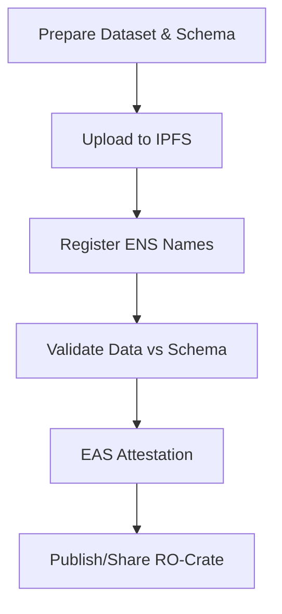

# RO-Crate Provenance Artifact: ENS + IPFS + EAS Workflow (HGP Chromosome 22 Example)

## Overview

This artifact provides a comprehensive, step-by-step workflow for publishing a historical research dataset (the Human Genome Project’s Chromosome 22 sequence) as an RO-Crate, registering it and its schema on ENS, storing on IPFS, and using EAS to attest to the integrity of the data and schema. It includes detailed pseudocode, metadata, and commentary to illustrate the full process.

---

## 1. Prepare Dataset and Schema

- **Dataset:** Human Genome Project Chromosome 22 sequence (33.4 Mb, first human chromosome sequenced)
- **Schema:** JSON Schema or RO-Crate profile describing expected structure (e.g., required metadata fields, file types)
- **RO-Crate:** Package the dataset, schema, and publication metadata in a machine-readable format


---

## 2. Upload to IPFS

- Upload the RO-Crate (as a zip or directory) to IPFS → get `DATA_CID`
- Upload the schema file to IPFS → get `SCHEMA_CID`
- (Optional) Upload the Nature PDF and FASTA file separately for direct linking    

---

## 3. Register ENS Names

- Register `hgp-chr22-data.eth` → set content hash to `DATA_CID`
- Register `hgp-chr22-schema.eth` → set content hash to `SCHEMA_CID`
- ENS provides human-readable, persistent names for both data and schema


---

## 4. EAS Attestation

- Use Ethereum Attestation Service (EAS) to create an attestation that:
    - The data at `hgp-chr22-data.eth` matches the schema at `hgp-chr22-schema.eth`
    - Include metadata: who attested, when, validation method, etc.
- EAS attestation is public, cryptographically verifiable, and can be referenced in the RO-Crate
    

---

## 5. Validation Workflow (Pseudocode with Comments)

```
# Step 1: Resolve ENS names to IPFS CIDs

data_ens = 'hgp-chr22-data.eth'
schema_ens = 'hgp-chr22-schema.eth'

data_cid = resolve_ens_to_ipfs(data_ens)   # e.g., via web3.py or ethers.js
schema_cid = resolve_ens_to_ipfs(schema_ens)

# Step 2: Fetch data and schema from IPFS

data = fetch_from_ipfs(data_cid)           # e.g., using ipfs-http-client
schema = fetch_from_ipfs(schema_cid)

# Step 3: Validate data against schema

if validate(data, schema):
    # Step 4: Create EAS attestation
    attestation = create_eas_attestation(
        subject=data_ens,                  # ENS name of the data
        schema=schema_ens,                 # ENS name of the schema
        result='match',                    # Validation result
        validator='your-eth-address',      # Who performed the validation
        timestamp=now()                    # When validation occurred
    )
    publish_attestation(attestation)       # Write attestation to EAS
    print('Validation succeeded and attestation published!')
else:
    print('Validation failed: data does not match schema')
    # Optionally, publish a negative attestation or alert
```

---

## 6. RO-Crate Metadata Example (JSON-LD)

```
{
  "@context": "https://w3id.org/ro/crate/1.1/context",
  "@graph": [
    {
      "@id": "ro-crate-metadata.json",
      "@type": "CreativeWork",
      "about": {"@id": "./"}
    },
    {
      "@id": "./",
      "@type": "Dataset",
      "name": "The DNA sequence of human chromosome 22",
      "description": "The first operationally complete sequence of a human chromosome, published by the Human Genome Project in 1999. The sequence consists of 12 contiguous segments spanning 33.4 megabases, containing at least 545 genes and 134 pseudogenes.",
      "datePublished": "1999-12-02",
      "license": "https://creativecommons.org/publicdomain/zero/1.0/",
      "author": [
        {
          "@id": "https://orcid.org/0000-0002-1825-0097",
          "name": "Ian Dunham"
        },
        {
          "@id": "https://orcid.org/0000-0001-5109-3700",
          "name": "Nobuyoshi Shimizu"
        }
        // ...add more authors as needed
      ],
      "hasPart": [
        {"@id": "chr22.fasta"},
        {"@id": "nature_paper.pdf"}
      ],
      "isBasedOn": {"@id": "https://www.ncbi.nlm.nih.gov/nuccore/NC_000022.11"},
      "citation": {
        "@id": "https://doi.org/10.1038/990031"
      },
      "publisher": {
        "@id": "https://www.nature.com/",
        "name": "Nature"
      },
      "distribution": [
        {
          "@type": "DataDownload",
          "contentUrl": "ipfs://<DATA_CID>",
          "encodingFormat": "application/zip"
        }
      ],
      "schemaReference": {
        "@id": "hgp-chr22-schema.eth"
      },
      "ensName": "hgp-chr22-data.eth",
      "easAttestation": {
        "@id": "eas://<ATTESTATION_UID>"
      }
    },
    {
      "@id": "chr22.fasta",
      "@type": "File",
      "name": "Chromosome 22 sequence (FASTA)",
      "encodingFormat": "text/fasta",
      "contentUrl": "https://www.ncbi.nlm.nih.gov/nuccore/NC_000022.11?report=fasta"
    },
    {
      "@id": "nature_paper.pdf",
      "@type": "File",
      "name": "Original Nature paper (1999)",
      "encodingFormat": "application/pdf",
      "contentUrl": "https://www.nature.com/articles/990031.pdf"
    },
    {
      "@id": "https://doi.org/10.1038/990031",
      "@type": "ScholarlyArticle",
      "name": "The DNA sequence of human chromosome 22",
      "author": [
        {"name": "I. Dunham"},
        {"name": "N. Shimizu"},
        {"name": "B. A. Roe"},
        {"name": "S. Chissoe"},
        {"name": "A. R. Hunt"},
        {"name": "J. E. Collins"},
        {"name": "R. Bruskiewich"}
        // ...add more authors as needed
      ],
      "datePublished": "1999-12-02",
      "isPartOf": {
        "@id": "https://www.nature.com/nature/"
      },
      "url": "https://www.nature.com/articles/990031"
    },
    {
      "@id": "hgp-chr22-schema.eth",
      "@type": "CreativeWork",
      "name": "HGP Chromosome 22 RO-Crate Schema",
      "description": "Schema describing the expected structure and metadata for the HGP Chromosome 22 RO-Crate.",
      "contentUrl": "ipfs://<SCHEMA_CID>"
    },
    {
      "@id": "eas://<ATTESTATION_UID>",
      "@type": "CreativeWork",
      "name": "EAS Attestation for HGP Chromosome 22 Data/Schema Match",
      "description": "Ethereum Attestation Service record confirming that the data at hgp-chr22-data.eth matches the schema at hgp-chr22-schema.eth."
    }
  ]
}
```

---

## 7. Commentary & Rationale

- **Why ENS?** ENS provides a persistent, human-readable name for both the dataset and its schema, making them easy to reference and discover.
    
- **Why IPFS?** IPFS ensures the data and schema are content-addressed, tamper-evident, and globally accessible.
    
- **Why EAS?** EAS provides a cryptographically verifiable, on-chain record that the data matches the schema, supporting trust and reproducibility.
    
- **Why RO-Crate?** RO-Crate packages all metadata, files, and provenance in a machine-readable, extensible format, making research objects FAIR (Findable, Accessible, Interoperable, Reusable).
    
- **Why is this better than print?** Unlike a static journal article, this approach makes the data, its structure, and its validation open, auditable, and future-proof.
    

---

## 8. Visual Workflow Diagram



---

## 9. Extending the Workflow

- **Fraud Detection:** If the data is altered, the IPFS hash changes, and the ENS record must be updated (which is public and auditable). If the data no longer matches the schema, validation fails and no attestation is issued.
    
- **Other Datasets:** This workflow can be reused for any dataset, including controversial or high-profile cases (e.g., Francesca Gino’s experiment).
    
- **Automation:** n8n or similar tools can automate the entire process, from IPFS upload to ENS update to EAS attestation.
    
- **Community Validation:** Multiple validators can independently attest to the data/schema match, increasing trust.
    

---

## 10. References

- [Nature: The DNA sequence of human chromosome 22](https://www.nature.com/articles/990031)
    
- [Genome.gov: 1999 Chromosome 22](https://www.genome.gov/25520396/online-education-kit-1999-chromosome-22)
    
- [NCBI GenBank: Human chromosome 22](https://www.ncbi.nlm.nih.gov/nuccore/NC_000022.11)
    
- [RO-Crate Specification](https://www.researchobject.org/ro-crate/)
    
- [Ethereum Name Service (ENS)](https://ens.domains/)
    
- [IPFS](https://ipfs.tech/)
    
- [Ethereum Attestation Service (EAS)](https://docs.attest.sh/)